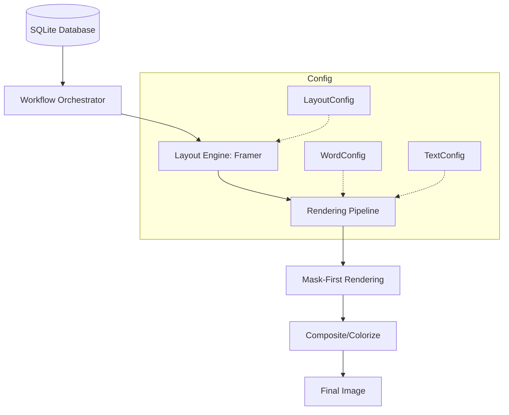

<div align="center">

# QuranMediaLib

</div>

A high-performance media generation library for rendering Quranic Arabic text and translations into customizable, professional-grade images.

**Requirements:** Python 3.13+

---

## 📌 Table of Contents
- [User Guide](#-user-guide)
    - [Installation](#installation)
    - [Quick Start](#quick-start)
    - [Presets Reference](#presets-reference)
    - [Built-in Workflows](#built-in-workflows)
    - [Demo Gallery](#demo-gallery)
- [Developer Guide](#-developer-guide)
    - [Architecture](#architecture)
    - [Core Thesis](#core-thesis)
    - [Core API Reference](#core-api-reference)
    - [Advanced Workflows](#advanced-workflows)
    - [Performance & Parallelism](#performance--parallelism)
    - [Development Suite](#development-suite)
- [Community & License](#-community--license)

---

## User Guide

### Installation

```bash
# Clone the repository
git clone https://github.com/AtTheZenith/quranmedialib.git
cd quranmedialib

# Install with uv (recommended)
uv pip install -e .
```

### Quick Start

```python
from quranmedialib import DatabaseManager, VerseWorkflow, LANDSCAPE_PRESET

# Initialize database manager
db = DatabaseManager()

# Configure layout using a preset (1080p Landscape Default)
layout, text_cfg, word_cfg = LANDSCAPE_PRESET["default"]["1080p"]
workflow = VerseWorkflow(layout, text_cfg, word_cfg)

# Render Surah 1, Ayah 1
translations = ["In the name of Allah,", "the Entirely Merciful, the Especially Merciful."]
pages = list(workflow.get_iterator(surah=1, ayah=1, translations=translations))

# Save first page
pages[0][0].save("output.png")

db.close()
```

### Presets Reference

The library uses a resolution-independent system. All sizing parameters scale linearly from a 1080p baseline.

| Aspect Ratio | Preset | Resolutions | Modes |
| :--- | :--- | :--- | :--- |
| **16:9** | `LANDSCAPE_PRESET` | 720p, 1080p, 1440p, 2160p | `default`, `arabic`, `translation` |
| **9:16** | `STORY_PRESET` | 720p, 1080p, 1440p, 2160p | `default`, `arabic`, `translation` |
| **1:1** | `SQUARE_PRESET` | 720p, 1080p, 1440p, 2160p | `default`, `arabic`, `translation` |

### Built-in Workflows

Workflows are high-level orchestrators that handle data retrieval, layout, and rendering.

#### `SurahWorkflow`
Processes an entire surah page by page.
```python
from quranmedialib import SurahWorkflow, LANDSCAPE_PRESET

layout, text, word = LANDSCAPE_PRESET["default"]["1080p"]
workflow = SurahWorkflow(layout, text, word)

for page_num, page_images in enumerate(workflow.get_iterator(surah=112), 1):
    for img, suffix in page_images:
        img.save(f"surah112_p{page_num}_{suffix}.png")
```

#### `VerseRangeWorkflow`
Processes a range of verses with support for parallel rendering.
```python
from quranmedialib import VerseRangeWorkflow, SQUARE_PRESET

layout, text, word = SQUARE_PRESET["default"]["1080p"]
workflow = VerseRangeWorkflow(layout, text, word)

# translations: list[list[str]] -> [verse_index][page_index]
translations = [["Trans V1"], ["Trans V2"]] 
iterator = workflow.get_iterator(surah=1, start_ayah=1, end_ayah=2, translations=translations)
```

### Demo Gallery
*Visual examples of generated content:*

<table width="800">
  <thead>
    <tr>
      <th align="left">Preset</th>
      <th align="center">Image</th>
    </tr>
  </thead>
  <tbody>
    <tr>
      <td><b>Landscape (1080p)</b></td>
      <td align="center"></td>
    </tr>
    <tr>
      <td><b>Story (1080p)</b></td>
      <td align="center"></td>
    </tr>
    <tr>
      <td><b>Square (1080p)</b></td>
      <td align="center"></td>
    </tr>
  </tbody>
</table>

---

## Developer Guide

### Architecture



### Core Thesis

QuranMediaLib is built on the **"Boring Code"** philosophy: prioritizing linear, obvious logic over clever abstractions to ensure long-term maintainability.

**Key Engineering Pillars:**
- **Resolution Independence**: Layouts are defined relative to a 1080p height and scaled linearly.
- **Memory Efficiency**: Use of `__slots__` for high-frequency objects and `lru_cache` for database queries.
- **Performance**: Mask-first rendering minimizes expensive RGBA operations.

### Core API Reference

#### `DatabaseManager`
A thread-safe singleton managing SQLite connections to Quranic databases.
- `get_verse(surah, ayah)`: Retrieves verse text.
- `get_verses_from_surah(surah)`: Retrieves all verses in a surah.
- `minimize_caches()`: Explicitly clears internal LRU caches.

#### Configuration
- `LayoutConfig`: Controls canvas dimensions, padding, and alignment.
- `WordConfig`: Defines Arabic font, size, colors, and spacing.
- `TextConfig`: Defines translation font, size, and rich-text formatting.

#### Resource Management
Custom assets can be loaded via:
- `FontResource.from_path("path/to/font.ttf")`
- `DatabaseConfig.from_path("path/to/db.sqlite")`

### Advanced Workflows

#### `IsolateWordsWorkflow`
Used to isolate individual words within their layout context, useful for word-by-word study tools.
```python
from quranmedialib import IsolateWordsWorkflow, LANDSCAPE_PRESET

layout, text, word = LANDSCAPE_PRESET["default"]["1080p"]
workflow = IsolateWordsWorkflow(layout, text, word)

# Isolates each word of the verse
iterator = workflow.get_iterator(
    surah=1, 
    verse_words=["الله", "الرحمن", "الرحيم"], 
    translations=["Allah", "The Merciful", "The Compassionate"]
)
```

### Performance & Parallelism

For bulk rendering, the library provides `ParallelRenderer`, which distributes tasks across CPU cores.

- **Execution Modes**: `ExecutionMode.PROCESS` (recommended for CPU-heavy tasks) or `ExecutionMode.THREAD`.
- **Memory Guard**: The system monitors aggregate RSS to prevent OOM crashes during large Surah renders.

### Development Suite

```bash
# Install dev dependencies
uv pip install -e ".[dev]"

# Run all tests
uv run -m pytest -v

# Run benchmarks
uv run -m pytest -v --benchmark

# Lint and Format
uv run -m ruff check .
uv run -m ruff format .
```

---

## Community & License

We welcome contributions from developers who value engineering rigor and performance.

- **Contribute**: See [`CONTRIBUTING.md`](CONTRIBUTING.md) for technical standards.
- **Conduct**: See [`CODE_OF_CONDUCT.md`](CODE_OF_CONDUCT.md).
- **License**: Apache License 2.0 - see [LICENSE](LICENSE).
