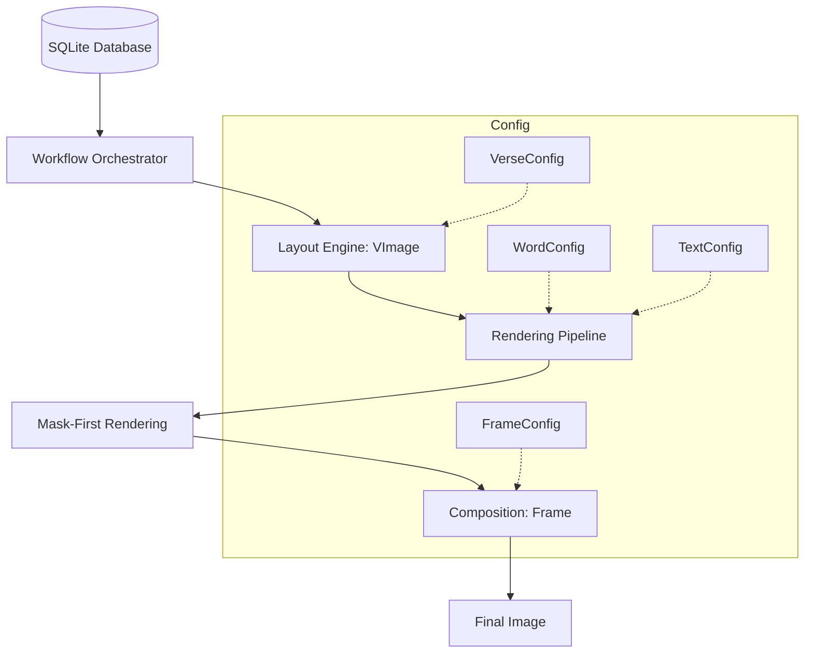

<div align="center">

# QuranMediaLib

[](https://pypi.org/project/quranmedialib/)
[](https://pypi.org/project/quranmedialib/)
[](https://pypi.org/project/quranmedialib/)
[](https://pypi.org/project/quranmedialib/)
[](https://github.com/astral-sh/ruff)

</div>

A high-performance media generation library for rendering Quranic Arabic text and translations into customizable, professional-grade images.

**Requirements:** Python 3.13+

---

## 📌 Table of Contents
- [User Guide](#user-guide)
    - [Installation](#installation)
    - [Quick Start](#quick-start)
    - [Presets Reference](#presets-reference)
    - [Built-in Workflows](#built-in-workflows)
    - [Demo Gallery](#demo-gallery)
- [Developer Guide](#developer-guide)
    - [Architecture](#architecture)
    - [Core Thesis](#core-thesis)
    - [Core API Reference](#core-api-reference)
    - [Advanced Workflows](#advanced-workflows)
    - [Performance & Parallelism](#performance--parallelism)
    - [Development Suite](#development-suite)
- [Community & License](#community--license)

---

## User Guide

### Installation

```bash
# Install from PyPI (recommended)
pip install quranmedialib

# Or clone and install from source
git clone https://github.com/AtTheZenith/quranmedialib.git
cd quranmedialib

# Install with uv (recommended)
uv pip install -e .
```

### Quick Start

```python
from quranmedialib import DatabaseManager, VerseWorkflow, LANDSCAPE_PRESET

# Initialize database manager
db = DatabaseManager()

# Load a 1080p Landscape preset
preset = LANDSCAPE_PRESET["default"]["1080p"]
workflow = VerseWorkflow(preset)

# Render Surah 1, Ayah 1
translations = ["In the name of Allah,", "the Entirely Merciful, the Especially Merciful."]
pages = list(workflow.get_iterator(surah=1, ayah=1, translations=translations))

# Save first page
pages[0][0].save("output.png")

db.close()
```

### Presets Reference

The library uses a resolution-independent system. All sizing parameters scale linearly from a 1080p baseline.

| Aspect Ratio | Preset | Resolutions | Modes |
| :--- | :--- | :--- | :--- |
| **16:9** | `LANDSCAPE_PRESET` | 720p, 1080p, 1440p, 2160p | `default`, `arabic`, `translation` |
| **9:16** | `STORY_PRESET` | 720p, 1080p, 1440p, 2160p | `default`, `arabic`, `translation` |
| **1:1** | `SQUARE_PRESET` | 720p, 1080p, 1440p, 2160p | `default`, `arabic`, `translation` |

### Built-in Workflows

Workflows are high-level orchestrators that handle data retrieval, layout, and rendering.

#### `SurahWorkflow`
Processes an entire surah page by page.
```python
from quranmedialib import SurahWorkflow, LANDSCAPE_PRESET

preset = LANDSCAPE_PRESET["default"]["1080p"]
workflow = SurahWorkflow(preset)

for page_num, page_images in enumerate(workflow.get_iterator(surah=112), 1):
    for img in page_images:
        img.save(f"surah112_p{page_num}.png")
```

#### `VerseRangeWorkflow`
Processes a range of verses with support for parallel rendering.
```python
from quranmedialib import VerseRangeWorkflow, SQUARE_PRESET

preset = SQUARE_PRESET["default"]["1080p"]
workflow = VerseRangeWorkflow(preset)

# translations: list[list[str]] -> [verse_index][page_index]
translations = [["Trans V1"], ["Trans V2"]] 
iterator = workflow.get_iterator(surah=1, start_ayah=1, end_ayah=2, translations=translations)
```

### Demo Gallery
*Visual examples of generated content:*

<table width="800">
  <thead>
    <tr>
      <th align="left">Preset</th>
      <th align="center">Image</th>
    </tr>
  </thead>
  <tbody>
    <tr>
      <td><b>Landscape (1080p)</b></td>
      <td align="center"></td>
    </tr>
    <tr>
      <td><b>Story (1080p)</b></td>
      <td align="center"></td>
    </tr>
    <tr>
      <td><b>Square (1080p)</b></td>
      <td align="center"></td>
    </tr>
  </tbody>
</table>

---

## Developer Guide

### Architecture



### Core Thesis

QuranMediaLib is built on the **"Boring Code"** philosophy: prioritizing linear, obvious logic over clever abstractions to ensure long-term maintainability.

**Key Engineering Pillars:**
- **Resolution Independence**: Layouts are defined relative to a 1080p height and scaled linearly.
- **Memory Efficiency**: Use of `__slots__` for high-frequency objects and `lru_cache` for database queries.
- **Performance**: Mask-first rendering minimizes expensive RGBA operations.

### Core API Reference

#### `DatabaseManager`
A thread-safe singleton managing SQLite connections to Quranic databases.
- `get_verse(surah, ayah)`: Retrieves verse text.
- `get_verses_from_surah(surah)`: Retrieves all verses in a surah.
- `minimize_caches()`: Explicitly clears internal LRU caches.

#### Configuration
- `Preset`: Unified config container (`preset.frame`, `preset.word`, `preset.verse`, `preset.text`).
- `FrameConfig`: Controls frame dimensions, background, and alignment.
- `VerseConfig`: Controls word spacing, row spacing, max rows, and wrapping.
- `WordConfig`: Defines Arabic font, size, colors, and spacing.
- `TextConfig`: Defines translation font, size, and rich-text formatting.

#### Resource Management
Custom assets can be loaded via:
- `FontResource.from_path("path/to/font.ttf")`
- `DatabaseConfig.from_path("path/to/db.sqlite")`

#### Rich Text Formatting
Translation text supports rich styling through inline tags.

**Syntax:**: `#<style>#<color>#text#` — the closing `#` is mandatory.

| Part | Value |
|------|-------|
| `style` | `b` (bold), `i` (italic), or `bi` (bold-italic) |
| `color` | 6-digit (`RRGGBB`) or 8-digit (`RRGGBBAA`) hex |
| `text` | The content to render |

Examples:
```python
"#b#ff0000ff#Bold red text#"
"#i#00ff00#Italic green text#"
"#bi#0000ffff#Bold italic blue text#"
```

A `#` that does not form a valid tag (e.g. a missing color or a stray hash) is
rendered literally and logs a `WARNING` that points out the malformed tag and the
expected syntax. Suppress that warning with
`TextConfig(ignore_non_token_hashtags=True)`, which still parses valid tags while
leaving the rest as literal text.

See the [`API reference`](docs/api_reference.md) for the full `TextConfig` surface.

#### Text Balancing
Multi-line translation now balances line lengths instead of greedy left-fill.
`TextConfig.balancing_mode` selects the solver (default `SMOOTH`):

| Mode | Solver | Use |
|------|--------|-----|
| `FORWARD` | Greedy max-fill | Fast, single-pass; always valid |
| `SMOOTH` (default) | Global flattest-split pyramid | Best visual balance for paragraphs |
| `KNUTH_PLASS` | Optimized guarded quadratic-slack DP | The global optimum at higher CPU cost |
| `TEX` | Micro-optimized faithful TeX port | Byte-identical to TeX for small inputs |

A word wider than the container always lands on its own line, and **greedy is the
unconditional fallback**: if the chosen solver cannot satisfy the constraints, the
library logs a reason (with a short text preview) and renders greedy. It returns
an infeasible layout only when greedy itself is unsatisfiable.

#### Output & Input Limits
To keep rendering robust against untrusted input, every text input is bounded
before measurement:
- `MAX_TEXT_CHARS` (10,000) — rejects a single text string longer than this.
- `MAX_TEXT_WORDS` (1,000) — rejects a text string with more tokens than this.
- `MAX_CANVAS_DIMENSION` (5,000) — a rendered canvas is clamped to this, so a
  single over-wide word cannot force an unbounded image allocation.

Violations raise `ValueError` (char/word) or clamp with a `WARNING` (canvas).

### Advanced Workflows

#### `IsolateWordsWorkflow`
Used to isolate individual words within their layout context, useful for word-by-word study tools.
```python
from quranmedialib import IsolateWordsWorkflow, LANDSCAPE_PRESET

preset = LANDSCAPE_PRESET["default"]["1080p"]
workflow = IsolateWordsWorkflow(preset)

# Isolates each word of the verse
iterator = workflow.get_iterator(
    surah=1, 
    verse_words=["الله", "الرحمن", "الرحيم"], 
    translations=["Allah", "The Merciful", "The Compassionate"]
)
```

### Performance & Parallelism

For bulk rendering, the library provides `ParallelRenderer`, which distributes tasks across CPU cores.

- **Execution Modes**: `ExecutionMode.PROCESS` (recommended for CPU-heavy tasks) or `ExecutionMode.THREAD`.
- **Memory Guard**: Per-process RSS enforcement via `worker_heartbeat()` every 10 verses. Workers crash immediately if they exceed 256MB. Aggregate RSS ~700MB during parallel renders is safe — no aggregate monitor needed.

### Development Suite

#### `quranmedialib.check` — Validation, Benchmarking & Reference Management

The `check` module is the canonical entrypoint for all regression testing. It wraps pixel validation, performance benchmarks, and unit tests into a single command.

| Subcommand | Description |
|------------|-------------|
| `list` | Enumerate canonical validation scenarios |
| `run` | Quick pixel validation (no benchmarks, no unit tests) |
| `test` | Full suite: pixel validation + benchmarks + unit tests |
| `update` | (Re)generate reference images for a specific version |
| `compare` | Cross-version pixel comparison (e.g., v4.0.0 vs v4.1.0) |
| `benchmark` | Standalone performance benchmarks |

```bash
# Install dev dependencies (uv sync installs the dev group: ruff, pytest, psutil)
uv sync

# Full suite (pixel validation + benchmarks + unit tests)
uv run -m quranmedialib.check test

# Quick pixel validation only (no benchmarks)
uv run -m quranmedialib.check test --no-benchmark

# Unit tests only (skip pixel validation and benchmarks)
uv run -m quranmedialib.check test --unit

# (Re)generate reference images for v4.1.0
uv run -m quranmedialib.check update --version v4.1.0

# Cross-version pixel comparison
uv run -m quranmedialib.check compare v4.0.0 v4.1.0

# Standalone benchmark run
uv run -m quranmedialib.check benchmark

# List all canonical validation scenarios
uv run -m quranmedialib.check list
```

**Reference pipeline**: The `update` command renders all canonical scenarios to PNG files under `src/quranmedialib/check/references/<version>/`. Each reference set includes `scenarios.json` (metadata), `sha256sums` (integrity hashes), and a `perf.json` benchmark artifact. The `compare` command performs pixel-level diffs between versions.

**Performance benchmarks**: The benchmark path runs file-based rendering (saves PNGs to disk via parallel async I/O, counts pages) to avoid deserializing ~3.8GB of RGBA image bytes over IPC. Memory is checked every 10 verses via `worker_heartbeat()` (per-process 256MB limit). Batch sizes use natural chunking (`ceil(tasks / workers)`) with adaptive down-capping in bytes IPC mode via `_bytes_mode_max_batch()`. No aggregate memory monitor — per-process enforcement catches leaks before they cascade.

#### Lint and Format

```bash
uv run -m ruff check .
uv run -m ruff format .
```

---

## Community & License

We welcome contributions from developers who value engineering rigor and performance.

- **Contribute**: See [`CONTRIBUTING.md`](CONTRIBUTING.md) for technical standards.
- **Conduct**: See [`CODE_OF_CONDUCT.md`](CODE_OF_CONDUCT.md).
- **License**: Apache License 2.0 - see [LICENSE](LICENSE).
